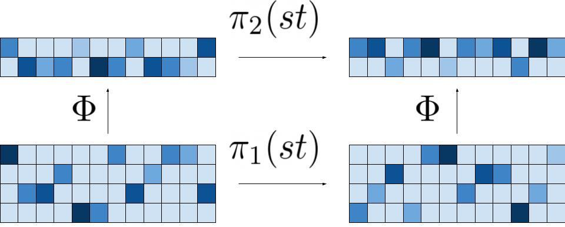

# Equi-RC : Equivariant layers for RC-complement symmetry in DNA sequence data

This is a repository that implements the layers as described in "Reverse-Complement Equivariant Networks for DNA 
Sequences" ([see paper](https://proceedings.neurips.cc/paper/2021/hash/706608cfdbcc1886bb7eea5513f90133-Abstract.html))
in Keras and Pytorch.

## Setup and notes
First, install Keras or Pytorch. Then you can install our package with pip, by running :
```
pip install equirc
```

This package includes both versions (PyTorch and Keras) of the code. To use, for instance the PyTorch layers,
just specify it in the import :

```
from equirc.pytorch_rclayers import RegToRegConv
```

## Summary of the paper

The DNA molecule contains two strands, each composed of a chain of nucleotides A, C, T and G. These strands
are complimentary : As and Cs are always paired with Ts and Gs respectively. Therefore, to represent a DNA molecule, one
can *arbitrarily* choose a strand and then encode the chain for instance in one hot encoding. The biological way to 
access this information, sequencing, yields the two possible representations. For ML tasks on the whole DNA (the two 
strands), such as molecule binding to the double helix, one want to have a stable prediction over the two possible 
representations of the input.

To find all possible networks satisfying this condition, we frame this into group theory. Indeed, given a sequence s, 
applying the reverse complement operation twice falls back onto s : RC(RC(s)) = s.
Therefore, this operation is a representation of the group Z2. To also have stability over the translation, we extend 
this group to the product Z x Z2. Then, we leverage the framework of equivariance :



Let X1 and X2 be two spaces with group actions π1 and π2, respectively. A function Φ going from X1 to X2 is said to be 
equivariant if Φ o π1 = π2 o Φ. This means that applying the group action π1 on an input x, and then going through Φ
yields the same result as first going through Φ and then applying π2. Equivariant functions can be composed, making it 
suitable for the design of deep learning layers.

We know what the input group action π0 on one-hot encoded DNA matrices is : we permute the channels A and C into T and G
and we reverse the sequence order. We need to also structure each intermediate spaces of our network with a group action.
This is similar to choosing the number of feature maps at each layer, except that beyond choosing only the dimension, we
also choose how the group will affect each column (the features at each point). Then a mathematical tool known as the 
induced representation extends this action on the columns onto the action on the whole matrix.

Once equipped with these representations, our paper finds all possible equivariant linear Φ and all non linear pointwise
Φ when the input and output representations are the same. We then show that previous methods, such as RCPS, are special
cases of this general setting. We also implement equivariant k-merisation and equivariant BatchNorm.

Finally we empirically investigate the efficiency of our networks. We show that having access to a larger functional 
space yields better performance, but do not find that a specific equivariant parametric function behaves consistently
better than others. This advocates for tuning these new hyperparameters onto the validation set, enabling to achieve
the best results.

## Practical design of equivariant networks

All the possible representations are described in the paper, but the practical ones to use are mostly of two types : 
- 'Irrep', with a and b two integers : a dimensions are unaffected by the group action and b dimensions see their signs
flipped.
- 'Reg' are regular layers : upon group action the column is reversed.

The a_n are of the dimensions of type +1, the b_n of type -1. The reg_in, reg_out arguments should be understood as the 
number of cycles and thus correspond to half the total dimension. For instance, in the input, we have 4 nucleotides and 
reg=2. For technical reasons (the formalism of continuous convolution as opposed to matrix multiplication), one need to
use only odd kernel sizes to ensure a strict equivariance. 

The layers name and parameters should be quite explicit, for instance the IrrepToRegConv is a linear layer going from a
space structured with the Irrep action to one structured with an Irrep action. This layer takes as parameters a_in and 
b_in which are the a and b dimensions of its input as well as reg_out which corresponds to its output group action.
The other layers (BatchNorm, Kmers) also follow this nomenclature. For the non linearities, you can directly use the 
ones native to your framework, following the rules of theorem 3. A practical implementation is to use any non linearity
in spaces with a 'Reg' structure, and odd non linearities such as tanh in spaces structured with Irrep spaces. We found
networks that balance a and b to perform better.

## Examples
### Keras
This class used for the Binary Prediction task is implemented as an example.
One can refer to this implementation and for testing, simply run :
```
python keras_example.py
```

### Pytorch
The equivalent class is also written in Pytorch, and can be ran with :
```
python pytorch_example.py
```

## Acknowlegements

We want to thank Hannah Zhou, Avanti Shrikumar and Anshul Kundaje for precious discussions.
We also thank Guillaume Bouvier and the CBIO members for advice.

## Contact

Please feel free to reach out by sending an email to vincent.mallet96@gmail.com or opening issues.

## Cite

If you want to cite this tool, please use :
```
@article{mallet2021reverse,
  title={Reverse-Complement Equivariant Networks for DNA Sequences},
  author={Mallet, Vincent and Vert, Jean-Philippe},
  journal={Advances in Neural Information Processing Systems},
  volume={34},
  year={2021}
}
```
